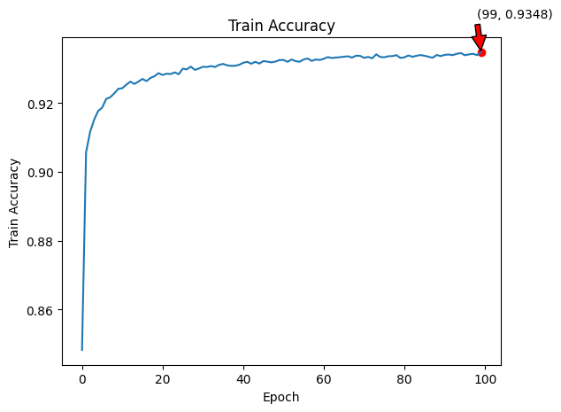

# SNN-MNIST
基于pytorch，spikingjelly实现SNN训练MNIST手写数据集
两个实现方式：

- 单层全连接SNN网络
  - 最高测试准确率: 92.89%
  - 最高训练准确率: 93.48%
- 卷积SNN网络（CSNN）
  - 最大测试准确率: 99.33%
  - 最大训练准确率: 99.99%

[TOC]

## 1. 单层全连接SNN网络训练MNIST数据集

### 1.1 引言
本文使用单层全连接脉冲神经网络（Spiking Neural Network，SNN）对MNIST数据集进行分类MNIST数据集包含手写数字的图像，是机器学习和神经网络领域中的一个经典测试数据集。

### 1.2 实验方法

#### 1.2.1 网络结构
SNN模型定义如下：
```python
class SNN(nn.Module):
    def __init__(self, tau):
        super().__init__()

        self.layer = nn.Sequential(
            layer.Flatten(),
            layer.Linear(28 * 28, 10, bias=False),
            neuron.LIFNode(tau=tau, surrogate_function=surrogate.ATan()),
        )

    def forward(self, x: torch.Tensor):
        return self.layer(x)
```
该模型包含一个线性层和一个LIF神经元层。LIF（Leaky Integrate-and-Fire）神经元具有泄露整合和放电机制，通过τ（tau）参数控制其时间常数。

#### 1.2.2 数据准备
使用PyTorch和TorchVision加载MNIST数据集，并进行数据预处理：
```python
data_dir = './data'
batch_size = 128
num_workers = 1
train_dataset = torchvision.datasets.MNIST(
    root=data_dir,
    train=True,
    transform=torchvision.transforms.ToTensor(),
    download=True
)

test_dataset = torchvision.datasets.MNIST(
    root=data_dir,
    train=False,
    transform=torchvision.transforms.ToTensor(),
    download=True
)

train_data_loader = data.DataLoader(
    dataset=train_dataset,
    batch_size=batch_size,
    shuffle=True,
    drop_last=True,
    num_workers=num_workers,
    pin_memory=True
)
test_data_loader = data.DataLoader(
    dataset=test_dataset,
    batch_size=batch_size,
    shuffle=False,
    drop_last=False,
    num_workers=num_workers,
    pin_memory=True
)
```

#### 1.2.3 参数设置及优化器
实验参数设置如下：
```python
tau = 2.0
T = 100
epochs = 100
learning_rate = 0.001
device = torch.device("cuda:0" if torch.cuda.is_available() else "cpu")

net = SNN(tau=tau)
net.to(device)

# 使用adam优化器
optimizer = torch.optim.Adam(net.parameters(), lr=learning_rate)
# 使用泊松编码器
encoder = encoding.PoissonEncoder()
```

#### 1.2.4 训练过程
训练过程中，使用均方误差（MSE）作为损失函数，并在每个epoch结束后记录训练和测试的准确率与损失：
```python
train_loss_record = []
train_acc_record = []
test_loss_record = []
test_acc_record = []

for epoch in range(epochs):
    net.train()
    train_loss = 0
    train_acc = 0
    train_samples = 0

    for img, label in train_data_loader:
        optimizer.zero_grad()
        img, label = img.to(device), label.to(device)
        label_onehot = F.one_hot(label, 10).float()
        out_fr = 0.
        for t in range(T):
            encoded_img = encoder(img)
            out_fr += net(encoded_img)
        out_fr = out_fr / T
        loss = F.mse_loss(out_fr, label_onehot)
        loss.backward()
        optimizer.step()
        train_samples += label.numel()
        train_loss += loss.item() * label.numel()
        train_acc += (out_fr.argmax(1) == label).float().sum().item()
        functional.reset_net(net)

    train_loss /= train_samples
    train_acc /= train_samples

    train_loss_record.append(train_loss)
    train_acc_record.append(train_acc)

    # 测试过程省略，类似训练过程
    # 记录test_loss和test_acc

    print(f'Epoch {epoch + 1}/{epochs}, Train Loss: {train_loss:.4f}, Train Acc: {train_acc:.4f}')
```

#### 1.2.5 结果可视化
训练和测试结果使用Matplotlib进行可视化展示：
```python
# 测试集准确率变化图像
plt.figure()
plt.plot(test_acc_record)
plt.xlabel('Epoch')
plt.ylabel('Test Accuracy')
plt.title('Test Accuracy')
plt.show()

# 训练集损失变化图像
fig = plt.figure()
ax = fig.add_subplot(2,1, 1)
ax.plot(train_loss_record)
ax.set_title(f'Train Loss')
ax = fig.add_subplot(2,1, 2)
ax.plot(test_loss_record)
ax.set_title(f'Test Loss')
plt.show()
```





### 1.3 反向传播更新规则分析

在脉冲神经网络中，反向传播的主要挑战在于处理非连续的脉冲事件。通过引入代理梯度（surrogate gradient）方法，可以近似计算不可导点的梯度。具体来说，LIF神经元的导数被代理函数（如Arctan函数）近似，从而使得误差可以通过网络传播。

### 1.4 结论
100个epochs中最高训练准确率达93.48%，测试集最高准确率92.89%

任选10张测试集数据，预测结果：


从训练结果可以看出，随着训练的进行，训练损失逐渐减小，准确率逐渐提高。实验成功验证了单层全连接SNN在MNIST数据集上的有效性。本文通过单层全连接SNN模型成功实现了对MNIST数据集的分类，验证了SNN的有效性。使用代理梯度方法解决了脉冲神经网络中反向传播的挑战。未来的研究可以尝试更复杂的网络结构和优化算法，以进一步提高性能。


## 2. 卷积SNN网络（CSNN）训练MNIST数据集

### 2.1 引言

本实验报告介绍了使用卷积脉冲神经网络(CSNN)对MNIST数据集进行分类训练的过程。该模型结合了卷积神经网络(CNN)的特征提取能力和脉冲神经网络(SNN)的时间动态特性。重点描述了模型结构设计和SNN的反向传播更新规则。

### 2.2 模型结构

{Conv2d-BatchNorm2d-IFNode-MaxPool2d}-{Conv2d-BatchNorm2d-IFNode-MaxPool2d}-{Linear-IFNode}

本实验中的CSNN模型由多个卷积层、池化层和全连接层组成，具体结构如下：

```bash
CSNN(
  (conv_fc): Sequential(
    (0): Conv2d(1, 64, kernel_size=(3, 3), stride=(1, 1), padding=(1, 1), bias=False, step_mode=m)
    (1): BatchNorm2d(64, eps=1e-05, momentum=0.1, affine=True, track_running_stats=True, step_mode=m)
    (2): IFNode(
      v_threshold=1.0, v_reset=0.0, detach_reset=False, step_mode=m, backend=torch
      (surrogate_function): ATan(alpha=2.0, spiking=True)
    )
    (3): MaxPool2d(kernel_size=2, stride=2, padding=0, dilation=1, ceil_mode=False, step_mode=m)
    (4): Conv2d(64, 64, kernel_size=(3, 3), stride=(1, 1), padding=(1, 1), bias=False, step_mode=m)
    (5): BatchNorm2d(64, eps=1e-05, momentum=0.1, affine=True, track_running_stats=True, step_mode=m)
    (6): IFNode(
      v_threshold=1.0, v_reset=0.0, detach_reset=False, step_mode=m, backend=torch
      (surrogate_function): ATan(alpha=2.0, spiking=True)
    )
    (7): MaxPool2d(kernel_size=2, stride=2, padding=0, dilation=1, ceil_mode=False, step_mode=m)
    (8): Flatten(start_dim=1, end_dim=-1, step_mode=m)
    (9): Linear(in_features=3136, out_features=1024, bias=False)
    (10): IFNode(
      v_threshold=1.0, v_reset=0.0, detach_reset=False, step_mode=m, backend=torch
      (surrogate_function): ATan(alpha=2.0, spiking=True)
    )
    (11): Linear(in_features=1024, out_features=10, bias=False)
    (12): IFNode(
      v_threshold=1.0, v_reset=0.0, detach_reset=False, step_mode=m, backend=torch
      (surrogate_function): ATan(alpha=2.0, spiking=True)
    )
  )
)
```


模型定义代码如下：

```python
class CSNN(nn.Module):
    def __init__(self, T: int, channels: int):
        super().__init__()
        #T 为模拟时间步数
        self.T = T

        self.conv_fc = nn.Sequential(
            layer.Conv2d(1, channels, kernel_size=3, padding=1, bias=False),
            layer.BatchNorm2d(channels),
            neuron.IFNode(surrogate_function=surrogate.ATan()),
            layer.MaxPool2d(2, 2),  # 14 * 14

            layer.Conv2d(channels, channels, kernel_size=3, padding=1, bias=False),
            layer.BatchNorm2d(channels),
            neuron.IFNode(surrogate_function=surrogate.ATan()),
            layer.MaxPool2d(2, 2),  # 7 * 7

            layer.Flatten(),
            layer.Linear(channels * 7 * 7, channels * 4 * 4, bias=False),
            neuron.IFNode(surrogate_function=surrogate.ATan()),

            layer.Linear(channels * 4 * 4, 10, bias=False),
            neuron.IFNode(surrogate_function=surrogate.ATan()),
        )

        #为了更快的训练速度，我们将网络设置成多步模式
        functional.set_step_mode(self, step_mode='m')
    
    #脉冲编码器：返回卷积神经网络的前三层：卷积层、批归一化层和脉冲发放神经元层
    def spiking_encoder(self):
        return self.conv_fc[0:3]
```

将图片直接输入到SNN，而不是编码后在输入，是近年来深度SNN的常见做法，在此也使用这样的方法。在这种情况下，实际的 `图片-脉冲` 编码是由网络中的前三层，也就是 `{Conv2d-BatchNorm2d-IFNode}` 完成。

网络的输入直接是 `shape=[N, C, H, W]` 的图片，我们将其添加时间维度，并复制 `T` 次，得到 `shape=[T, N, C, H, W]` 的序列，然后送入到网络层。网络的输出定义为最后一层脉冲神经元的脉冲发放频率。因而，网络的前向传播定义为：

```python
class CSNN(nn.Module):
    def forward(self, x: torch.Tensor):
    # x.shape = [N, C, H, W]
    x_seq = x.unsqueeze(0).repeat(self.T, 1, 1, 1, 1)  # [N, C, H, W] -> [T, N, C, H, W]
    x_seq = self.conv_fc(x_seq)
    fr = x_seq.mean(0)
    return fr
```


### 2.3 训练

使用SGD优化器

```python
lr = 0.1
optimizer = torch.optim.SGD(net.parameters(), lr, momentum=0.9)
```


#### 2.3.1 训练过程

为了训练SNN，采用了替代梯度法对IF神经元进行优化。训练代码如下：

```python
epochs = 64
train_acc_record = []
train_loss_record = []
test_acc_record = []
test_loss_record = []

for epoch in range(epochs):
    start_time = time.time()
    net.train()
    train_loss = 0
    train_acc = 0
    train_samples = 0
    for img, label in train_data_loader:
        optimizer.zero_grad()
        img = img.to(device)
        label = label.to(device)
        label_onehot = F.one_hot(label, 10).float()

        
        out_fr = net(img)
        loss = F.mse_loss(out_fr, label_onehot)
        loss.backward()
        optimizer.step()

        train_samples += label.numel()
        train_loss += loss.item() * label.numel()
        train_acc += (out_fr.argmax(1) == label).float().sum().item()

        functional.reset_net(net)

    train_time = time.time()
    train_speed = train_samples / (train_time - start_time)
    train_loss /= train_samples
    train_acc /= train_samples
    train_acc_record.append(train_acc)
    train_loss_record.append(train_loss)

    net.eval()
    test_loss = 0
    test_acc = 0
    test_samples = 0
    with torch.no_grad():
        for img, label in test_data_loader:
            img = img.to(device)
            label = label.to(device)
            label_onehot = F.one_hot(label, 10).float()
            out_fr = net(img)
            loss = F.mse_loss(out_fr, label_onehot)

            test_samples += label.numel()
            test_loss += loss.item() * label.numel()
            test_acc += (out_fr.argmax(1) == label).float().sum().item()
            functional.reset_net(net)
    test_time = time.time()
    test_speed = test_samples / (test_time - train_time)
    test_loss /= test_samples
    test_acc /= test_samples
    test_acc_record.append(test_acc)
    test_loss_record.append(test_loss)


    print(f'epoch = {epoch}, train_loss ={train_loss: .4f}, train_acc ={train_acc: .4f}, test_loss ={test_loss: .4f}, test_acc ={test_acc: .4f}')
    print(f'train speed ={train_speed: .4f} images/s, test speed ={test_speed: .4f} images/s')
    print(f'escape time: ' , time.strftime('%Y-%m-%d %H:%M:%S',time.localtime(time.time()))) 
    

```

### 2.4 反向传播更新规则

在SNN中，由于脉冲神经元的不连续性，传统的反向传播算法不能直接应用。因此，使用替代梯度方法对脉冲神经元进行优化。具体步骤如下：

1. **正向传播**：通过网络计算输入样本的输出脉冲频率。
2. **损失计算**：使用交叉熵损失函数计算预测结果与真实标签之间的误差。
3. **替代梯度**：由于脉冲神经元的非连续性，使用替代函数（如Arctan函数）计算近似梯度。
4. **参数更新**：通过反向传播算法，根据计算得到的替代梯度信息更新网络权重。

在代码中，IF神经元的替代函数使用了Arctan函数，如下所示：

```python
neuron.IFNode(surrogate_function=surrogate.ATan())
```


### 2.5梯度替代原理

[梯度替代 — spikingjelly alpha 文档](https://spikingjelly.readthedocs.io/zh-cn/latest/activation_based/surrogate.html#id1)


### 2.5 结论

训练结果：


最大测试准确率: 99.33%
最大训练准确率: 99.99%

随机10张测试集识别：


​	本实验展示了如何使用CSNN对MNIST数据集进行分类，详细介绍了模型结构。通过替代梯度方法，成功实现了脉冲神经网络的训练，并验证了其在图像分类任务中的有效性。实验结果表明，CSNN在处理时间序列数据时具有良好的性能，能够有效捕捉图像中的特征信息。

​	**CSNN比单层全连接SNN有着更好的性能**


## 参考

- MNIST数据集介绍：http://yann.lecun.com/exdb/mnist/

- [使用单层全连接SNN识别MNIST — spikingjelly alpha 文档](https://spikingjelly.readthedocs.io/zh-cn/latest/activation_based/lif_fc_mnist.html)

- [使用卷积SNN识别Fashion-MNIST — spikingjelly alpha 文档](https://spikingjelly.readthedocs.io/zh-cn/latest/activation_based/conv_fashion_mnist.html)